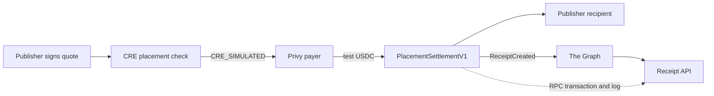

# AdReceipt

AdReceipt makes a paid AI recommendation independently checkable. A publisher signs the exact
recommendation context and price, a Privy-managed payer settles test USDC directly to the named
recipient, and one immutable receipt is indexed by The Graph. The API accepts a receipt as paid
only when the indexed fields match the successful Sepolia transaction and its event log.

The receipt proves that a specific payment happened for a signed recommendation context. It does
not prove that payment caused a model response, that the recommended product is good, or that an
independent customer has adopted the system.

## Current V1 flow



`PlacementSettlementV1` has no escrow, DNS, ENS, registry, or spend-tier gate. It checks the
publisher's EIP-712 signature, payer, token, amount, recipient, chain, contract, expiry, subject
hash, schema version, and replay nonce before transferring the exact amount.

## Live Sepolia evidence

| Component     | Verified state                                                                                                                                                                                                                                                                                   |
| ------------- | ------------------------------------------------------------------------------------------------------------------------------------------------------------------------------------------------------------------------------------------------------------------------------------------------ |
| Settlement    | [`0x2fB6889Cc142C622a0479aF56b75B98beAeD3576`](https://sepolia.etherscan.io/address/0x2fB6889Cc142C622a0479aF56b75B98beAeD3576), deployed at block `11648834` in [transaction `0xf2db…c584`](https://sepolia.etherscan.io/tx/0xf2dbcfa9c1ede10519c37cedce0e69f59b1f0e8fc5b761edb69742cd5852c584) |
| Asset         | Circle test USDC, [`0x1c7D…7238`](https://sepolia.etherscan.io/address/0x1c7D4B196Cb0C7B01d743Fbc6116a902379C7238)                                                                                                                                                                               |
| Subgraph      | Studio version `0.0.1`, deployment `QmXQmu8ce7JEATADtGXK65NceaKsF79Jz8whT9S6Tx3N8E`; [query endpoint](https://api.studio.thegraph.com/query/1754808/adreceipt/0.0.1)                                                                                                                             |
| Privy         | Default-deny policy rejected a disallowed signing request and allowed the bounded approval plus settlement                                                                                                                                                                                       |
| Chainlink CRE | `CRE_SIMULATED`: eligible and over-bid paths pass locally; no confidential workflow is deployed                                                                                                                                                                                                  |
| Paid receipts | [`0xa63f…f9cd`](https://sepolia.etherscan.io/tx/0x29d0f2cb187f8c33d06329dd90f59dcd82b346c62c701cce53f37253cb69db28), settled through the bounded Privy policy in block `11652460`                                                                                                                |

The publisher and recipient used for the first test are team-controlled. This transaction proves
the testnet integration, not third-party adoption. Exact deployment data is stored in
[`deployments/placement-settlement-sepolia.json`](deployments/placement-settlement-sepolia.json).

Detailed evidence and proof boundaries are documented for [Privy](docs/evidence/privy.md),
[Chainlink CRE](docs/evidence/chainlink.md), and [The Graph](docs/evidence/the-graph.md). The team’s
use of coding assistants is described in [AI_ASSISTANCE.md](AI_ASSISTANCE.md).

## Frozen receipt event

```solidity
event ReceiptCreated(
    bytes32 indexed receiptId,
    bytes32 indexed campaignId,
    bytes32 indexed subjectHash,
    address publisher,
    address payer,
    address recipient,
    address asset,
    uint256 amount,
    uint64 settledAt,
    uint16 schemaVersion
);
```

The Graph mapping, generated ABI, RPC decoder, and API verifier all use this exact schema. Changing
its fields or indexed parameters requires coordinated updates across those components.

## Repository map

```text
contracts/                     Direct settlement and supporting prototype contracts
test/                          Hardhat settlement and contract tests
backend/src/privy/             Owner-authorized Privy client and default-deny policy
backend/src/receipts/          Graph query, RPC evidence reader, and fail-closed verifier
subgraph/                      ReceiptCreated indexing for the live Sepolia contract
cre/placement-authorization/   CRE placement policy workflow and simulation tests
frontend/                      V1 campaign commitment and public receipt verification UI
deployments/                   Public testnet deployment records
```

The DNS, ENS, tier, and refundable-escrow code is retained as an earlier prototype. It is not part
of the accepted V1 payment path.

## Local verification

Requirements: Node.js 22, npm, and Bun 1.3.14.

```bash
git clone https://github.com/Anand-0037/adreceipt.git
cd adreceipt
npm ci
npm --prefix backend ci
npm --prefix frontend ci
npm install --prefix subgraph --no-audit --no-fund
npm run cre:install
npm run verify:all
```

`verify:all` compiles contracts and the CRE WASM workflow, builds the subgraph and frontend, then
runs contract, Graph, backend, and CRE tests plus every TypeScript check. Tests and simulations are
local evidence; they do not substitute for a public transaction or a deployed confidential
workflow.

For local configuration, copy [`.env.example`](.env.example) and
[`backend/.env.example`](backend/.env.example). Never commit API keys, wallet keys, deploy keys, or
private policy material.

## Receipt API

```http
GET /receipts/0x<32-byte-receipt-id>
GET /receipts/0x<32-byte-receipt-id>?atBlock=<positive-block-number>
GET /subjects/0x<32-byte-subject-hash>
GET /deployment
GET /health
GET /health/privy
```

The verifier returns `PAID_VERIFIED` only after it finds the Graph entity and independently confirms
the successful transaction, expected settlement contract, exact `ReceiptCreated` log, Sepolia chain,
schema, and every indexed field. Missing or inconsistent provider evidence fails closed.

## Web flow

- `/campaign` prepares contract-compatible campaign, placement, product, content, and `SubjectV1`
  commitments in the browser. It does not sign or broadcast a transaction.
- `/ask` queries live Graph receipts by the exact recommendation `subjectHash`, verifies each
  candidate through RPC, and changes the disclosure behavior only for `PAID_VERIFIED`.
- `/receipts/:id` shows the full payment binding, Graph head, RPC chain, transaction, block, and
  explorer links.

The HTTP service exposes only V1 read endpoints. Privy transaction submission stays in the
operator-controlled scripts, so a public caller cannot trigger a wallet transaction or a legacy
DNS attestation.

## Remaining external work

- Deploy the web app and API to stable public URLs, then run a cold demo.
- Deploy the CRE workflow only if Confidential Workflows access becomes available.

## License

MIT — see [LICENSE](LICENSE).
