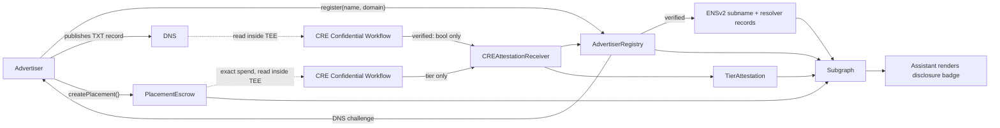

# AdReceipt

Verifiable sponsorship disclosure for AI recommendations.

When an assistant recommends a product, you cannot tell whether that recommendation was paid
for, or whether the brand behind it is even real. AdReceipt is a registry that makes both
checkable: an advertiser must cryptographically prove it controls the brand it claims before it
can pay for a placement, its payment flows through an on-chain escrow, and every recommendation
carries a badge showing verification status, a coarse spend tier, and history.

It answers two questions: **is this advertiser provably who they claim to be**, and **roughly how
much did they pay**. It deliberately does not answer whether the product is any good — a verified
badge means "provably who they say they are", nothing more.

## Live on Sepolia

| Contract | Address | Deployed at block |
| --- | --- | --- |
| `AdvertiserRegistry` | [`0xcE99a9ee7DD1af77e47036fe679fd1aDfFf2F8ac`](https://sepolia.etherscan.io/address/0xcE99a9ee7DD1af77e47036fe679fd1aDfFf2F8ac) | 11640382 |
| `PlacementEscrow` | [`0xdC0Ec3b71eb9228059A98afa52768308406e72C7`](https://sepolia.etherscan.io/address/0xdC0Ec3b71eb9228059A98afa52768308406e72C7) | 11640383 |
| `TierAttestation` | [`0x26769eCfF7207a551744632B5eEc71b0056a2816`](https://sepolia.etherscan.io/address/0x26769eCfF7207a551744632B5eEc71b0056a2816) | 11640384 |
| `CREAttestationReceiver` | [`0x5D31343761b7d2f68cFdd014dA1767D86FA26d97`](https://sepolia.etherscan.io/address/0x5D31343761b7d2f68cFdd014dA1767D86FA26d97) | 11640385 |
| `PermissionedResolver` | [`0x4FcC23A8528E26fba51BD9a2B4F417Af8C0ca89e`](https://sepolia.etherscan.io/address/0x4FcC23A8528E26fba51BD9a2B4F417Af8C0ca89e) | 11640386 |
| `DisclosedSubnameRegistry` | [`0x97aAfb7F0776E763280369489dAa5E6ACF4abca6`](https://sepolia.etherscan.io/address/0x97aAfb7F0776E763280369489dAa5E6ACF4abca6) | 11640388 |
| `SuspiciousPatternRule` | [`0x28f5Df28FC951762bC400b819a872eBe2cb11470`](https://sepolia.etherscan.io/address/0x28f5Df28FC951762bC400b819a872eBe2cb11470) | 11640389 |

Full record, including deployment parameters and role assignments:
[`deployments/sepolia.json`](deployments/sepolia.json).

## How it works



1. **Register.** An advertiser claims a brand name and a domain. The claim is unverified — anyone
   can type anything — and the registry issues a per-claim DNS challenge.
2. **Prove.** The advertiser publishes the challenge as a TXT record. A Chainlink CRE Confidential
   Workflow resolves it inside a TEE and only the boolean verdict leaves the enclave.
3. **Name.** A verified advertiser receives an ENSv2 subname under a parent name, with its status
   written as text records the advertiser itself cannot forge.
4. **Pay.** Placements are funded through a non-custodial escrow. There is no admin path to those
   funds.
5. **Tier.** A second confidential workflow buckets cumulative spend into Minimal / Moderate /
   Major inside the enclave. The exact figure is never published.
6. **Read.** The assistant queries indexed events and renders a badge per recommendation.

Three properties are enforced in code rather than promised:

- **Identity gates payment.** `createPlacement` reverts unless the registry says verified. Prove
  first, then pay — never the reverse.
- **The escrow is non-custodial.** No function moves escrowed value to anyone but the depositor.
  A test asserts this against the compiled ABI.
- **Owning a name does not let you make claims about yourself.** Text records under the
  `disclosed.` prefix are registry assertions, writable only by a narrowly delegated account and
  never by the name's owner.

## Status

| Area | State |
| --- | --- |
| Contracts | **Deployed to Sepolia.** 146 tests passing, 35/35 live wiring checks |
| Backend API | **Built.** Challenge issuance, DNS verification, attestation submission, badge reads |
| Confidential handler logic | **Built** and simulated, with the enclave boundary expressed as types |
| CRE workflow registration | **Not done.** The SDK registration is the remaining gap — see [`backend/cre/README.md`](backend/cre/README.md) |
| End-to-end run on Sepolia | **Not yet.** The registry is empty; no advertiser has been verified on-chain |
| ENS subname issuance | **Not exercised.** Contracts deployed, zero subnames issued |
| Subgraph | **Not indexing the live contracts** |
| Web application | Not started |

Nothing here should be read as more than it is: a passing test is not a deployed contract, and a
deployed contract is not a verified advertiser.

## Sponsor tracks

- **Chainlink — Best Confidential Workflow.** Two confidential handlers: the DNS challenge is
  fetched and compared inside the enclave and only a boolean leaves it; cumulative spend is
  bucketed inside the enclave and only the band leaves it. The tier handler combines the public
  on-chain figure with a private off-chain one, so the total cannot be reconstructed from chain
  state.
- **The Graph — Best AI Tooling.** Every value on a disclosure badge is indexed on-chain data:
  verification status, spend tier, advertiser age, placement count.
- **ENS — Best Use of ENSv2.** A subname registry with per-name Permissioned Resolvers and
  record-level Enhanced Access Control, so the verification oracle can write exactly one text
  record and nothing else, revocable in one transaction.

## Repository layout

```text
contracts/        Solidity contracts, interfaces and libraries
scripts/          deployment
test/             146 Hardhat tests
deployments/      live contract addresses per network
backend/src/      API, chain client, DNS verification, tier computation
backend/cre/      confidential workflow handlers and enclave boundary
subgraph/         indexing (in draft PR #8)
```

## Quickstart

Requirements: Node.js 22 and npm.

```bash
git clone https://github.com/Anand-0037/adreceipt.git
cd adreceipt
cp .env.example .env      # fill in SEPOLIA_RPC_URL at minimum
npm ci
npm run build
npm test
```

Backend:

```bash
npm --prefix backend ci
npm --prefix backend run dev              # API on :8080
npm --prefix backend run cre:simulate     # confidential handler simulation
npm --prefix backend run verify:live:dry  # full pipeline against Sepolia, writes nothing
```

The backend reads contract addresses from `deployments/<network>.json`, so a redeploy needs no
code change.

## Under review: direct settlement receipts

[Issue #7](https://github.com/Anand-0037/adreceipt/issues/7) proposes replacing the refundable
escrow with a direct settlement receipt — a publisher-signed quote, exact payer-to-recipient
settlement, and one immutable `ReceiptCreated` event per placement.

The critique behind it is sound: `PlacementCreated` records a deposit the advertiser can withdraw,
which is evidence of committed spend but not proof that a publisher was paid. The receipt model
would close that gap.

It is not implemented. The event ABI, quote fields and replay protection are still being decided,
and the deployed contracts above implement the escrow model. A candidate subgraph for the proposed
event is in [draft PR #8](https://github.com/Anand-0037/adreceipt/pull/8).

## Demo disclaimer

All brand names and figures used in the demo — DeployCo, RenderStack, HostFast — are fictional,
and all data is illustrative. The demo runs against our own assistant; there is no public API for
injecting into a commercial assistant's ad system, and intercepting one would be both fragile and
legally reckless.

## Contributing

Start with an issue and keep each branch tied to one outcome. See [CONTRIBUTING.md](CONTRIBUTING.md).

## License

MIT — see [LICENSE](LICENSE).
