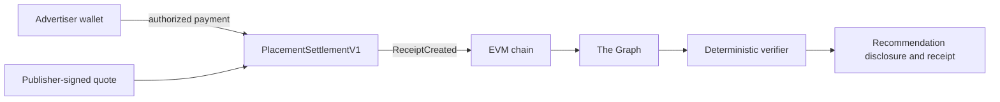

# AdReceipt

AdReceipt helps people verify the commercial payment attached to an AI recommendation.

An ordinary sponsored label asks the user to trust the platform that displayed it. AdReceipt is
designed to bind a visible recommendation to a public settlement receipt containing the payer,
recipient, asset, amount, campaign, content commitment, and transaction reference.

It proves that a payment was attached to the recommendation. It does not prove that the payment
caused the model's answer, that the recommendation is good, or that no off-platform arrangement
exists.

## V1 flow

1. A publisher prepares the final recommendation and signs an expiring placement quote.
2. An authorized advertiser wallet settles the exact quoted payment through
   `PlacementSettlementV1`.
3. Successful settlement emits one immutable `ReceiptCreated` event.
4. A Subgraph indexes the receipt and its transaction context.
5. Server-side verification checks the expected contract, chain, content commitment, payment
   fields, indexer freshness, and finality.
6. The product displays a neutral disclosure only when those checks pass.



## Current state

The repository is being moved from an earlier refundable placement-escrow prototype to the direct
settlement receipt described above.

| Area | Current boundary |
| --- | --- |
| Existing contracts | Compile and pass 139 tests, but represent the earlier escrow/identity prototype |
| Receipt settlement | Event and quote interface are under review in [issue #7](https://github.com/Anand-0037/adreceipt/issues/7) |
| Subgraph | Candidate schema, mapping, queries, and tests are in [draft PR #8](https://github.com/Anand-0037/adreceipt/pull/8) |
| Testnet deployment | Not deployed yet |
| Live Graph verification | Not available yet |
| Web application | Not implemented yet |

No local fixture or passing unit test should be interpreted as a live payment, deployed contract,
or provider-backed receipt.

## Verification states

The application will use explicit states rather than letting an LLM decide whether evidence is
valid:

- `PAID_VERIFIED`: a matching finalized receipt from the expected deployment
- `PENDING`: the settlement is not yet final or indexed far enough
- `NOT_FOUND_AT_BLOCK`: a fresh query found no matching receipt as of a stated block
- `INVALID`: a receipt exists but a required field or content commitment does not match
- `UNAVAILABLE`: Graph, RPC, or required evidence cannot be checked

`NOT_FOUND_AT_BLOCK` does not mean that a recommendation is organic, unbiased, or trustworthy.

## Repository layout

```text
contracts/   Solidity contracts and interfaces
scripts/     deployment scripts
test/        Hardhat contract tests
subgraph/    receipt indexing code (in draft PR #8)
apps/web/    planned recommendation and receipt application
```

## Local contract setup

Requirements: Node.js 22 and npm.

```bash
git clone https://github.com/Anand-0037/adreceipt.git
cd adreceipt
npm ci
npm run build
npm test
npm run typecheck
```

Graph commands and deployment boundaries are documented inside `subgraph/` once that package is
merged.

## Contributing

Start with an issue and keep each branch tied to one outcome. See [CONTRIBUTING.md](CONTRIBUTING.md)
for the branch, test, and review workflow.

## License

AdReceipt is available under the [MIT License](LICENSE).
